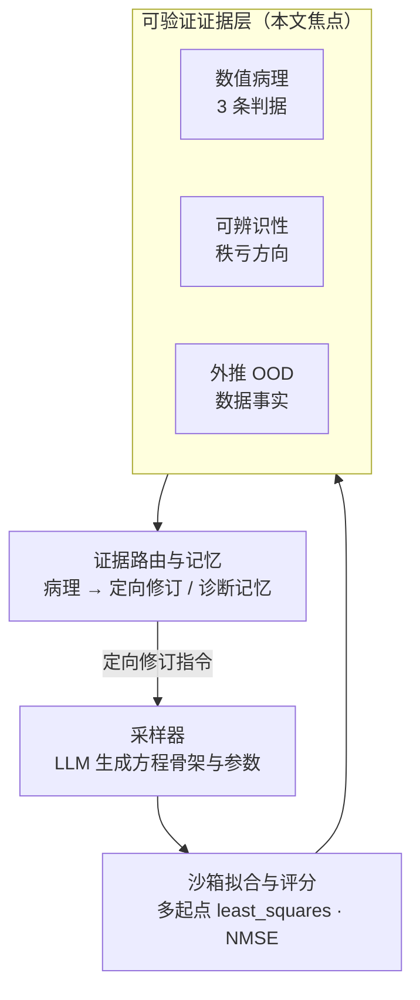

# MaSED 研究改进与创新建议

> **文档性质**：基于 `papers/` 下 18 篇文献精读 + 本仓库全量代码/产物审计形成的**选题分析与创新方案**，用于支撑一篇学术小论文与硕士学位论文核心章节。
> **生成日期**：2026-09-26
> **修订**：2026-09-26 —— 独立复核（文献逐页取证 + 仓库实测），更正 §2.3 / §2.4 / §2.5 / §8 / §9 / 附录 A 中与工作区当前状态不符的数字与结论（§8.1 的"文件错配"判定**不成立**），附录 B 增补核验项。本轮新增内容一律标 `[核验新增]`，未标注的段落未改动。
> **依据**：`papers/**`（18 个 PDF，文献引用已逐页复核）、`docs/ARCHITECTURE.md`、`drsr_420/**`、`experiments/**`、`data/**`
> **状态标记约定**：`[已验证]` = 本次直接读代码/文件确认；`[据原文报告]` = 引自文献正文，未独立复现；`[未确认]` = 存疑待查。

---

## 0. 结论速览

**一句话判断**：本项目的差异化资产（**可验证奖励 + 数值病理体检 + 敏感度剪枝 + 样本外验证 + 结构化事实表**）恰好压在文献公认的**最大空白**上——"验证与物理可信性系统性缺位"；但作为一篇论文，它当前**证据链是断的**：有机制、无 benchmark、无 baseline、无多种子统计、无消融，且绝大多数实验产物（490 次运行里仅 4 份 `report.md`）不支持"最优解 = 可信科学结论"这一跳跃。

**建议的论文主线**（不是"再加 agent"）：

> 现有 LLM 符号回归智能体只优化**标量拟合误差**，因而系统性地产出三类**未被检出的伪发现**——数值病理（角点钉扎 / 门控 / 大系数抵消）、不可辨识参数化、外推失效。本文把"**可验证的可信性判据**"从收尾诊断提升为**一等奖励与诊断信号**，形成可归因的闭环，并在统一 ID/OOD 协议下证明其收益。

**三个主创新**：① 数值病理作为第三类失败模式 + 诊断定向反馈；② 可辨识性感知的假设空间收缩；③ 可归因编排与细粒度可验证信用分配。
**两个支撑创新**：A 经验记忆结构化/可证伪化；B 评测协议 + 环境形式化（**论文成立的地基**）。

---

## 1. 文献图景

### 1.1 四层结构

| 层 | 文献 | 核心机制 | 是否多智能体 | 记忆 / 知识 |
|---|---|---|---|---|
| 早期锚点 2024 | ChatSR / LASR / 多智能体物理 | 数据当模态端到端回归 / 概念库 + PySR / 六阶段流水线 | 否 / 否 / **是** | 无 / **概念库** / Formula Memory |
| Agentic 核心 2025 | Symbolic-R1 / SR-Scientist / IdeaSearchFitter | 微调 + Form-GRPO + HER / 工具化 ReAct + 经验缓冲 / explain-then-formalize | 否 / 单 agent / 双 LLM | 记忆库 / 堆式 top-K / 无 |
| Agentic 核心 2026 | LLM-ODE / Deliberate Evolution / A-SR | 方程组 Pareto / Direction–Diagnosis–Memory 三分 / 角色×证据视图 + bandit | 否 / 单 / **是** | 无 / 反思记忆 / **状态路由记忆** |
| 框架与评测 | MASTER / Robin / DORA / LLM-SRBench | LLM 专用 MCTS / Crow–Falcon–Finch / 多智能体虚拟科研团队 + 自动报告 / **239 题标准基准** | 是 / 是 / **是** | 树内上下文 / 文献 RAG / — / — |
| 编排与综述 | HALO / Puppeteer / COMPASS / 两篇综述 | 层级 MCTS / **可学习编排器（REINFORCE）** / 上下文刷新 + Meta-Thinker / EEA 环境形式化 | 是 | 无 / 无 / 滚动 note / 三粒度 |

### 1.2 方法演进主线（2024 → 2026）——对选题定位最关键

1. **反馈信号**：单一标量 MSE → **标量 + 残差诊断 + 量纲/有效性 + OOD 风险**。DE（ICML'26）与 A-SR 均证明"诊断工具"是最大增益项（DE 消融：去掉诊断 4.37e-4 → 2.52e-2）`[据原文报告]`。`[核验注明：DE 的这条消融数字已逐页核对为原文原句；A-SR 侧"诊断是最大增益项"的排序本轮未独立核验，引用时请分开写]`
2. **记忆**：无 → prompt top-K（SR-Scientist）→ 概念库（LASR）→ 反思记忆（DE）→ **角色/状态路由记忆**（A-SR）。
3. **控制单元**：改表达式 → **改"哪个角色看到哪份证据"**（A-SR）；**解耦"提议"与"搜索控制"**（DE）。
4. **评测**：Feynman → **LLM-SRBench**（Transform 变换 + Synth 合成 + OOD，专为**防记忆污染**设计）。
5. **失败诊断**：由"非法程序 / 参数不稳"两类 → **尚无第三类（数值病理）**。← **本文的位置**

### 1.3 文献暴露的 6 个研究空白

| # | 空白 | 证据 | MaSED 是否占优 |
|---|---|---|---|
| G1 | **验证与物理可信性缺位**：选择准则几乎只有 goodness-of-fit；量纲检查在 IdeaSearchFitter 只是可选开关；无系统化数值病理/外推/先验冲突检测 | 多智能体物理论文自述会选出"常数过度复杂、对参数敏感"的公式 | ✅ **强占优** |
| G2 | **经验/记忆原始且不可迁移**：多为"标量分 + top-K"；SR-Scientist 自述"会重复探索失败的方程"；LASR 概念可能错误且无一致性约束 | EEA §6.1 指出现有经验管理缺完整 insert/delete/update/retrieve 设计 | ✅ 占优（多岛缓冲 + RAG） |
| G3 | **噪声/真实数据鲁棒性不足**：主体评测仍在无噪合成数据 | ChatSR、SR-Scientist 自述噪声下显著掉点 | ⚠️ 有素材未用（`oscillator2` 自带噪声） |
| G4 | **编排不可学习、无信用分配**：MASTER 手设 UCT；Puppeteer 明确只有终态奖励；HALO 的 value 由 LLM 自评；A-SR 自认"规则协调器非学习型" | 文献一致承认 | ❌ 需新建 |
| G5 | **多智能体名不副实**：角色提示叠层，无跨角色信用分配 / 协议学习 | 2402.01680 §6.3 原句 "They adjust agents in isolation"（各自孤立地调整，非 "evolve in isolation"） | ❌ 需新建 |
| G6 | **评测碎片化 + 记忆污染无法横比**：数据集/判据/种子/ID-OOD 口径全不统一；LLM-SRBench 自身也无多种子协议、无成本指标、非 LLM 基线只测了 PySR | 各篇数字不可横比 | ⚠️ 数据已在本地，未跑 |

**战略含义**：G1 与 G2 几乎无人做透，而它们正是 MaSED 投入最多的模块 → 最适合作论文创新锚点；G4/G5 留作延伸（因 MaSED 奖励**可验证**，做细粒度信用分配比 COMPASS 的 LLM-judge 版本更强）。

---

## 2. 项目现状审计

### 2.1 已具备的机制

| 机制 | 定位 | 状态 |
|---|---|---|
| 编排闭环 采样→评估→反思→持久化 | `drsr_420/agents/coordinator_agent.py:233-266` | 写死的固定循环 |
| 多起点有界拟合（5 起点） | `drsr_420/evaluation/problems.py:132-208` | 稳健 |
| 数值病理体检（3 判据：跨度 15 / 斜率 2.0 / 大系数 8.0） | `drsr_420/core/range_check.py:61-113` | **原创性最强**，但只做罚分 |
| 多岛经验缓冲 + 聚类软采样 + 同族去重 | `drsr_420/core/buffer.py:99-129` | 领先于多数 LLM-MAS |
| 敏感度剪枝（未真剪则返回原式） | `drsr_420/analysis/sensitivity_prune.py:99-150` | 可作消融对象 |
| 样本外验证 + 重合检测 | `drsr_420/analysis/holdout.py:149-231` | 仅报告，不参与选择 |
| 事实表 + 骨架基线 + 可辨识性 | `drsr_420/evaluation/data_facts.py:193-259` | **算了但没进搜索闭环** |
| 文献 RAG + 机器生成参考文献 | `drsr_420/analysis/explain.py:319-330` | LLM-SRBench Discussion 公开呼吁的方向 |

### 2.2 超参与硬限制

`MAX_NPARAMS=10`、`PARAMS_BOUNDS=±1e4`、`N_STARTS=5`、`MAX_ITER=300`、`num_islands=10`、`num_samplers` 默认 1、`samples_per_prompt=4`、CLI `niterations` 默认 10。
**硬限制**：任何骨架最多 10 个可训练常数；而 `MRFCompress-Cuboid` 训练集只有 **8 行** → "8 点拟合 10 参数"是数值必然。

### 2.3 已跑实验盘点 `[已验证]`

- `experiments/` 共 **498 个 run 目录（含旧布局 `experiments/<问题>_<时间戳>/`）、8 个问题**（截至 2026-09-26 15:50；本次新增冒烟 `150834` 与正式 `151008` 两个）。`[核验新增：原记 456，早期按单层目录统计得 490]`
- **基本只做了 MRF 一个物理域**；BPG0（LLM-SRBench 风格）**67** 次中仅 1 次产出 samples。`[核验新增：原记 56]`
- **仅 6 个 run 有 `report.md`**：`MRFCompress-Cuboid_{20260925-134149, 20260925-152830, 20260926-094330, 20260926-110809}` + 本次两项改动后新增的 `{20260926-150834（冒烟）, 20260926-151008（正式）}`。`[核验新增：原记 2 个；`2072250` 之后新跑的 2 个 run 全部产出了 report.md]`
- `samples/` 只保留 top-10（`drsr_420/core/profile.py:87`）→ **绝大多数 run 的完整采样历史已丢失**。✅ `[已修 2026-09-26，commit 2072250]` 默认改为**全量落盘**（每样本一个 `samples_<order>.json`），并修掉 `find_best_sample` 只认 `*_samples_*.json`（读不到全量文件名）的隐患。
- 代码中无 PySR/gplearn 等外部 baseline，只有内部"骨架基线表"；`seed` 默认 `None`，**无多种子重复**。
- `[核验新增]` 各问题 run 数（存在 `samples/` 的个数）：Compress-Cuboid 145（76）、Shear-2 112（47）、BPG0 67（1）、Compress-Ellipsoid 61（61）、Shear-Ellipsoid 49（49）、Shear-Cuboid 34（33）、Shear-3 16（16）、MRFCompress-3 6（6）。

### 2.4 可评测性缺口

| 缺口 | 实测事实 |
|---|---|
| 无标准 benchmark | 498 次运行几乎全在 MRF 一个域 |
| 无外部 baseline | 无 PySR / gplearn / DSR 实现 |
| 无统计显著性 | `seed=None`，无均值±方差 |
| 无消融框架 | 多岛/经验/残差/病理罚分/剪枝均可关，但无消融脚本与表格 |
| 产物不支持结论 | 498 次运行仅 6 份 `report.md`；样本只留 top-10 —— ✅ `[已修 2026-09-26，commit 2072250]` 默认全量落盘 + 收尾报告必出（改动后新跑的两个 run 均产出报告与全量轨迹） |
| 可辨识性未闭环 | `data_facts.py:338` 只写进提示词与报告 |
| 算力/成本 | 仅 run 级 `progress.json` 记 LLM token，**无报告级汇总**；`[核验新增]` 实测 `MRFCompress-Cuboid_20260926-110809`：**89 个评估样本 = 1,414,069 tokens**（prompt 988,658 / thinking 325,291 / content 100,120），墙钟 ≈4,120 s → **≈15.9k tokens、≈46 s 每样本**（可据此换算任何"题数 × 种子数"的预算，见 §8.3 成本行） |

### 2.5 方法论软肋（削弱结论可信度）

1. **样本内极小 ≠ 泛化**：README 自述 8 点 10 参数、样本内 NMSE 1.4e-7，而 held-out 相对误差 7.95%——但该 held-out **只有 2 个点**（`data/MRFCompress-Cuboid/test.csv` = λ12∈{1.5, 4.5}，落在训练点 1,2,2.5,3,3.5,4,5 **之间**，是**插值**而非 OOD），故这条只能作"现象存在"的提示，**不能作统计结论**。`[核验新增]` 更硬的证据是 `.trae/documents/handoff.md` 记录的多次运行：样本外/内 NMSE 比 **7.9e3 ~ 8.8e9** 不等，并**存在 1.1× 的稳定反例**——"不稳定"与"稳定"两类都能观测到，因此 E3 必须把反例一并报告。
2. **病理解仍被发布**：`experiments/.../20260925-134149/report.md` 的发布式自认"病理性器件"却仍然发布。→ ✅ `[已修 2026-09-26，commit 2072250]` 收尾新增**病理门禁**：候选里优先发布体检罚分 == 0 的最高分样本，被降级的最高分样本连同它的分数与罚分写进 report.md 的「发布解选择」小节。
3. **经验当事实注入**：残差有 `[unverified hypothesis]` 标注，但 Good/Bad 经验文本**无任何未校验标注**就直接进提示词（`drsr_420/agents/prompt_injection.py:378-404`，实测仅注入 `successful experience / needs improvement / failure lesson` 三个类别标签）。→ ✅ `[已修 2026-09-26，commit 2072250]` 经验块标题已改为 UNVERIFIED HYPOTHESES 口径。
4. **经验多样性塌缩**：因 top-10 里 9/10 属同一族才事后加了 `_MAX_PER_SKELETON_FAMILY`（`prompt_injection.py:81`、`_dedupe_by_family` 359-377）→ 说明同质化是已发生事实。
5. **早停阈值是绝对 batch 数、按单个 MRF 问题标定**：`drsr_420/core/config.py:105-111` 的四个默认值**全是 `None`**（并非硬编码数值），实际生效值写在 run 的 `config_snapshot.json`：`target_nmse=1e-6`、`early_stop_patience=20`、`min_batches_before_early_stop=10`、`max_failed_batches=3`。其中 `patience` / `min_batches` 与数据规模无关 → 有过拟合到该问题之嫌（`target_nmse` 运行时按 `var(outputs)` 换算，见 `config.py` 注释）。
6. **体检结论的措辞边界**：只能写"未检出"某类病理，不能写"无病理"——判据是有限网格上的有限度量。
7. `[核验新增]` **架构邻域探索缺失（本次实测到的真正瓶颈）**：判别性 post-mortem（`MRFCompress-Cuboid_20260926-110809`，87 个有评分样本全量）显示 **52/87（60%）是同一个完整二阶响应面**（两个平方项 + 交叉项）的重新参数化——换记号、平移 `λ−1`、取对数都被采样器当成"新架构"；而"**删掉一个平方项**"的 5 参数非对称形式（该实验里分数最高的干净骨架）**一次都没被提出**。经验块的族去重与残差通道都只产出"换个写法"的建议，对"该架构已触底"没有反应。⚠️ 注意：§5 的三个主创新**都不覆盖**这一维度。

### 2.6 可复用资产（可直接作论文实验基础设施）

- `drsr_420/core/range_check.py`：纯 numpy 病理内核，无上层依赖，适合独立成评测指标。
- `drsr_420/evaluation/problems.py` + `evaluation/sandbox.py`：拟合/打分口径清晰，常驻 worker 稳健。
- `drsr_420/core/buffer.py`：FunSearch 式多岛缓冲，可作消融对象。
- `drsr_420/analysis/**`：`holdout.py`、`prune_report.py`、`sensitivity_prune.py`、`expr_parse.py`、`expr_curves.py`、`progress_curve.py` 全部单职责、可回填、可单测。
- `drsr_420/evaluation/data_facts.py`：事实表 + 骨架基线 + 可辨识性，天然的报告底座。
- `drsr_420/core/profile.py` 的 `samples/`、`best_history/`、`round_progress.csv`、`config_snapshot.json`：可支撑复现与统计。
- 分层护栏 `tests/test_architecture.py` + 33 个测试文件：保证重构不改口径。

### 2.7 本地已备而未用的 benchmark `[已验证]`

`data/` 里**已经躺着一整套 benchmark，但从没跑过**——这是"补 benchmark"成本远低于预期的原因：

| 类别 | 数据集 | 结构 | 备注 |
|---|---|---|---|
| LSR-Synth 风格 4 域 | `BPG0`(生物 dP/dt)、`CRK0`(化学 dA/dt)、`PO0`(物理 dv/dt)、`MatSci0`(材料 σ) | 各 4001 行 + `test.csv` + `ood_test.csv` | 与 LLM-SRBench 的 Synth 四域对应 |
| Feynman 族 | `I.37.4_0_1`(80001 行)、`I.48.2_1_0`、`II.6.15b_3_0`、`III.4.33_3_0` | `train.csv` + `test.csv` | 对应 LSR-Transform 的前身 |
| LLM-SR 真实任务 | `oscillator1`、`oscillator2`（**自带 noise 数据**）、`stressstrain`、`bactgrow` | `train.csv` + `test_id.csv` + `test_ood.csv` | 含 ID/OOD 划分 |

⚠️ **两个前提问题**：
1. **真值表达式缺失**：SA 指标需要 ground-truth 公式，而本地只有 CSV → 需从 LLM-SRBench 仓库取回对应 JSON 元数据；Feynman 族真值可由 Feynman 方程表推出。
2. **规模仅为子集**：本地每类只有 4 题（官方 Transform 111 / Synth 128）→ 需先决定"下载全量"还是"定义一个有理据的子集"。

---

## 3. 文献 ↔ 项目映射

| 维度 | 文献最强 | MaSED 现状 | 结论 |
|---|---|---|---|
| 奖励来源 | 多为 LLM 自评（MASTER/Robin/HALO） | **NMSE 可验证** + 病理 + 可辨识性 | **结构性优势，论文须显式声明** |
| 搜索控制 | Puppeteer 可学习编排 / DE 三分信号 | 固定循环 + 无记忆 softmax | **必须新建**（创新 3） |
| 记忆 | A-SR 状态路由 / DE 反思记忆 | 多岛缓冲但无结构、只增不减 | 升级（支撑 A） |
| 上下文 | COMPASS 固定槽位 + 预算 | 全量拼接 `experiences.json` | 升级（支撑 A） |
| 可信性验证 | **无人做透** | 已有 3 判据 + 剪枝 + holdout | **主创新 1，抢占 G1** |
| 可辨识性 | **无人进闭环** | 已计算，未使用 | **主创新 2** |
| 评测 | LLM-SRBench 239 题 | 数据已在本地，未跑 | 必须补齐（支撑 B） |
| 环境形式化 | EEA 八域**无符号回归** | 沙箱是事实上的环境但未声明 | 可主张新环境类别 |

> `[核验注明]` 上表两处"无人"的证据强度不同：**G1（数值病理未进选择准则/奖励）已由 18 篇关键词全扫证实**（见附录 B）；"可辨识性无人进闭环"本轮**未做同等力度的全扫**（仅确认 A-SR 有 numerical stability 检查、LASR 有概念约束），写入论文前建议补一次同口径核验。

---

## 4. 选题定位

**不要**把论文做成"我们实现了一个多智能体系统"——那会被 A-SR（同为分层协调）、DE（更样本高效）正面压死。

**应**做成"**可信性感知的符号回归智能体**"，把马太效应最强的那块空白（G1 + G2）变成主场：

- **对标对手**：A-SR（最近的同类多智能体）与 DE（样本效率最强）。**必须在消融中证明"病理诊断 + 可辨识性约束"带来的增益不是超参红利**。
- **不可替代性锚点**：`drsr_420/core/range_check.py` 的三判据是用**真实实验数据标定**出来的（健康带 / 病理带的实测分界），文献里**没有对应物**，可写成公式、可复现。

### 目标架构（闭环形态）



即：把现有"收尾诊断"上移为**闭环中的一等证据层**，并把它的结构化输出经**证据路由**编译为**定向修订指令**回灌采样器——这是三个主创新的共同落地形态。

---

## 5. 创新方案

### 5.1 创新 1（核心）：数值病理作为第三类失败模式 + 诊断定向反馈

**问题定位**。文献把候选失败归为两类：非法程序、参数不稳（A-SR 的 `z ∈ {invalid, param}`）。但实测发布解

```
σ = 119.054 + 3.24323·λ12² + (35.1515 − 14.0837·λ12^(−40.153))·λ23^0.8106
    + 49.6889·λ12^(−40.153)
```

**程序合法、参数稳定、MSE 很好**，却是一个只在 λ12=1 角点非零的"门控器件"（器件自身动态范围 1.16e28，而包围盒输出跨度仅 2.15 倍）。**这一类失败在全部 18 篇文献中无对应概念、无判据、无治理机制。**

**三层创新内容**：

1. **判据层（已有，需形式化）**：三判据已在真实数据上标定（跨度 15 / 斜率 2.0 / 大系数 8.0）。需补的是**形式化表述**与**判据完备性讨论**——判据三与设计矩阵条件数在数学上相关（见 §5.2），可考虑合并为统一的"参数–预测敏感性"谱刻画，而非三个经验阈值。
2. **信号层（新）**：从**标量罚分**升级为**结构化病理报告** `{criterion, dim, 触发位置(角点/壳层/区域), 量级, 特征尺度(如门控半衰期)}`。
3. **闭环层（新，最关键增量）**：把病理报告编译为**定向修订指令**注入采样器。核心是设计"**病理形态 → 可执行编辑约束**"映射表：
   - 门控 / 下溢 → 禁止该维引入 |指数| > k 的幂律，改用全局单调族；
   - 大系数抵消 → 强制输出量级与数据跨度同阶；
   - 溢出尖峰 → 施加输出有界先验。

**与文献的差异**（审稿人必问）：

| | DE (ICML'26) | A-SR | **本文** |
|---|---|---|---|
| 诊断内容 | 残差/量纲/统计（一般性） | 状态标签路由 | **数值病理（专门类）** |
| 诊断去向 | 反馈给提议器 | 路由到角色 | **编译为编辑约束** |
| 判据来源 | 通用定义 | 规则 | **真实实验标定的健康/病理分界带** |
| 可验证性 | 需 LLM 解释残差 | LLM-judge | **纯数值、可复现** |

**验证设计**：三臂对照——(A) 关病理判据；(B) 仅标量罚分（现状）；(C) 罚分 + 定向指令。指标除 NMSE/Acc@0.1 外，**新引入"病理率"**（发布解中带病理的比例）。

**风险**：LLM 可能忽略指令 → 必须**单独报告"指令遵循率"**，否则会被质疑"增益来自罚分而非诊断"。

#### 实测补充：三臂同数据同预算（2026-09-26，MRFCompress-Cuboid）

三臂参数完全一致（`niterations 5 × samplers 4 × 4`，target_nmse 1e-6，同数据/背景/LLM/启动脚本）：

| 臂 | 处理 |
|---|---|
| `110809` | 无（基线） |
| `151008` | 处理 1 = 架构地形注入 + 经验块"未校验"标注 |
| `161441` | 处理 1 + **处理 2 = 未试邻域实测分数 + 分数分解**（本轮新增，见下方 [已实现]） |

| 判据 | `110809`（无） | `151008`（处理 1） | `161441`（处理 1+2） |
|---|---|---|---|
| 有评分样本 | 87 | 88 | 92 |
| **完整二阶响应面（两平方+交叉）** | **52/87 = 60%** | **0/88 = 0%** | 18/92 = 20% |
| **非对称二次（缺 λ12²）出现次数** | **0** | **0** | **14** |
| 族分布 | second_order 52 / power_law 23 / coupled 12 | **power_law 63** / coupled 16 / higher 6 / other 3 | power_law 30 / partial_second 22 / coupled 19 / second_order 18 / higher 1 / other 2 |
| 不同 term set 数 | 11 | 20 | 21 |
| **最高分** | **−1.1130**（MSE 0.4253 + 罚分 0.6877） | **−16.9095**（MSE 16.9095，罚分 0） | **−0.2716**（MSE 0.2716，罚分 **0**） |
| **最好解 NMSE** | 2.11e-4（**带**罚分 0.6877） | 8.40e-3（干净） | **1.35e-4（干净）** |
| 干净候选 | 0/10（top-10 全带病理） | 38/89 | 57/93（**top-10 10/10 干净**） |
| 产物 | `report.md` ✓，轨迹仅 top-10 | `report.md` ✓，全量 89 条 | `report.md` ✓，全量 93 条 |
| tokens | 1.41 M | 1.15 M | 1.60 M |

**处理 2 的机制核验（不只看结果，看"提示有没有被用上"）**：本轮 `run.out` 里未试邻域实测注入 53 处、分数分解 23 处；首次注入落在"最近已评估样本 = order 21"之后，于是：

- 非对称二次出现在 order **36 / 55 / 58 / 59 / 61 / 66–68 / 77–80 / 85 / 92**（前两臂 88、89 个样本里 **0** 次）；
- order 58 的分数 **−0.867473** 与注入里给的口径数 **−0.8675**（"高于当前最好 −1.113"）逐位吻合 → 模型确实照提示去试了那个 term set；
- order 71（最终最好、干净）正是"非对称二次 + λ23³"——即提示里"再动一个项 / 改一个项的函数形式"的落点，NMSE **1.35e-4**，优于历史最好 2.11e-4（且后者带罚分）。

**四条结论**：

1. **处理 1 的副作用被处理 2 修回来了**：家族垄断仍被压制（60% → 20%，不再是 0% 的"清零"），而最优分不再退化——反而从 −1.113 / −16.909 提升到 **−0.2716 且干净**（NMSE 1.35e-4）。即 §5.1 结论 1 的"力度过猛"确实是**缺了可验证的数**造成的，不是"不该注入结构事实"。
2. **"未试邻域必须带可验证的数"得到证实**：前两臂点名 term set 采纳 **0** 次，本轮 **14** 次，且 order 58 与注入给的预测值吻合到 5 位有效数字（详见上方核验）。
3. **成本**：tokens +39%（1.60 M vs 1.15 M）。但注入本身只占很小一部分（实测地形块约 2 KB × 数十条提示 ≈ 数万 token）；其余是一次运行内工具调用/推理长度的波动，**单 run 无法归因**，需要多种子协议才能把成本项说清。
4. **局限（必须写进论文的口径）**：单 run、无种子协议；且本轮样本数 92 vs 88/87（**+5%** 探索机会本身也贡献了一部分改善），无法与"提示改动"完全解耦。**振荡指标没有改善**：相邻样本在"干净 ↔ 带罚分"间切换 41/92（151008 是 33/88）——但该指标跨岛交错、定义粗糙（各岛上下文不同），且本轮 top-10 已 10/10 干净，故不作为主判据，仅留档。

由此闭环层的设计要点修正为：**（i）未试邻域必须带实测 NMSE；（ii）采样提示必须暴露 `(拟合 MSE, 体检罚分, 命中的判据)` 的分解**——否则模型会把"MSE 0.197 + 罚分 36.06"当成胜利（151008 的 order 34 就是这种样本），在病理解家族里反复打转（"低 MSE 高罚分 ↔ 高 MSE 零罚分"两模态振荡）。

**[已实现]**（`evaluation/architecture_facts.py` 的 `template_from_terms`/`measure_term_set` + `core/sample_records.py` 的 `score_breakdown`；两条注入通道共用）。要点：

- 未试邻域由 term set **标签**机械还原成"代表元参数化"再真拟合（同 bounds / 多起点 / 固定种子 `FIT_SEED=BASELINE_SEED`）。多项式族与恒等记号张成同一线性空间，故代表元的 NMSE 与平移/取对数写法**精确相同**；`higher` 与 `power(a,b)` 各自归并多个形状、无法唯一还原 → **不猜**，提示里显式写"未测量"及原因；
- 比较用的是**实测分数**（`-(拟合 MSE + 罚分)`）而非 NMSE：两模态本来就落在同一条评分轴上。**离线核验**（110809 的真实数据与架构）：`drop λ12²` 的非对称二次实测 MSE **0.8675**（NMSE 4.31e-4）、罚分 0 → 隐含分数 **−0.8675**，**高于该轮实际最高分 −1.1130**；完整二次型实测 MSE 0.4253（更低）却带罚分 0.6876 → 分数 −1.113。这就是"既能干净又能拟合好的解存在"的可执行版本；本轮 `161441` 的 order 58 实测 **−0.867473**，与该预测逐位吻合（见上方机制核验）；
- 分数分解只从**已落盘样本记录**取数，且"最好干净解"**只**在罚分恰为 0 的记录里选（旧目录无 `penalty` 字段时显式写"分解不可用"，不当成 0）。

#### 多种子协议中暴露的闭环层缺陷（2026-09-26 ~ 09-28；前五条由协议暴露，第 6 条由首个带全部修复的 run 暴露；**六条均已修**）

前五条都由 `MRFCompress-Cuboid` 同参数多 seed 跑动的产物直接量出（协议 **6/6 已跑完**：T1 = 仅架构地形注入，T2 = 地形 + 未试邻域实测分数 + 分数分解，seed 11/22/33 两臂配对，产物在 `experiments/MRFCompress-Cuboid/ab-terrain-{only,measured}/`）。**协议中途不改代码**（改了就破坏臂内可比性），故记在此处作为下一轮迭代的输入。缺陷的严重度依赖臂级读数，先写清：**臂间差异在噪声内**（最好分 T1 **−0.766 ± 0.408** vs T2 **−0.669 ± 0.344**，n=3，std 是差距的 3~4 倍），**run 间波动才是主导**（T2 臂内 s22 −0.2716 与 s11/s33 −0.8675 差 3.2 倍），且 **T1-s11（−0.3171）优于 T2-s11 与 T2-s33**。

1. **微抖动会把注入闸门锁死**。注入闸门是"自最优以来 ≥ 5 个样本"，但 refit 抖动会不断把 `best_order` 推到样本前沿。实测 `20260927-164553` 的 `best_history` 在 order 23→65 之间发生 **5 次"刷新"、累计改善仅 1.5e-10**（同一个模型，相邻两次差 1e-13~1e-11），于是 `自最优以来` 恒 < 5 → **恰好在卡住时地形块被静默关闭**（把该时刻的块渲染出来是**空串**，已复核）。量化：地形块只出现在 48~59% 的提示里（T1 12/23、T2 13/22 与 10/21）。修法：给"刷新"加相对容差（与 coordinator 早停同一思路），只在**实质**改善时推进 `best_order`。T2-s33（`20260928-092926`）给出更重的一版：撞地板后 order 49/62/65/73 的 4 次"刷新"累计只改善 **8.6e-10**（8.2e-10 / 2.1e-11 / 1.3e-11 / 2.5e-12），于是地形块**自己报的**停滞被一路重置——`run.out`（L21417）里 parsed 80 那次写成 `samples since that best: 8`（锚在 order 73），若锚在真正的最后进步 order 47 应为 **33**。即：闸门即使开着，抖动也会把"卡了多久"这个最强的压力信号稀释成"卡了 8~12 个"。**[已修 2026-09-28]** `best_order` 改由 `significant_best()` 定：按 order 走一遍，改善必须超过 `SIGNIFICANT_IMPROVEMENT_REL/ABS`（1e-6，与渲染精度同量级）才推进。**离线回放 T2-s33 的最终产物**：自最优以来 12 → **38**（锚回 order 47）；而真实改善不受影响——T2-s22 的 order 79（0.271565）照样推进。
2. **实测邻域在带 `higher` / `power(...)` 标签的族上整体失效**。跳出地板后的族是 `{const, higher, λ12, λ12λ23, λ23, λ23²}`（= 非对称二次 + λ23³），它的 3 个一阶删项**全部**报"不可机械还原"（`higher` 归并多种形状，按设计"不猜"）→ **在最前沿那个族上，实测分数一条都给不出**。修法：从**目标方程的实际加项文本**还原（保留该族的真记号），而不是从标签还原。实测该失效有两种：**标签不可还原**与**采样器漂进不可还原的族**。T2 臂三跑的 `measured on THIS run` 行数是 s11 **101** / s22 **99** / s33 **34**（提示条数几乎相同：22 / 24 / 24）；差别来自 T2-s33 的采样器整期落在参数指数幂律分支（`lambda23**params` 出现在 23 个样本，T2-s22 只有 3 个），其族标签 `power(a,b)` 不可还原 → 未试邻域降级成 `NOT measured here`（T2-s33 **13** 次 vs T2-s22 **7** 次）。该处置**在最需要它的那一支上静默关闭了**：不是测不准，是连测都不测。（离线复核：run 末态该族的覆盖是 1/3 而非 0/3——"全部"是当时那一条提示的读数；整族失效的量级见下面的 A/B。）**[已修 2026-09-28]** `term_texts()` 从**目标方程自己的项文本**取出该项（别名按原式展开、参数保留 `params[k]`），由 `representative_from_text()` 的 **AST 白名单求值器**求值——不用 `eval`/`exec`，越界一律降级并写明"文本不可求值"。**A/B（同一批真实产物）**：前 6 大族的未试邻域覆盖率 T2-s33 **21/24 → 24/24**、T2-s22 **19/25 → 25/25**；最典型的是 `{const, power(λ12), power(λ12,λ23), power(λ23)}` 从 **1/3 → 3/3**。
3. **`max_tokens=65536` 同时制造"尾部变慢"与"截断解"**。单次响应上限被 clamp 在 65536（`llm/client.py`），而 thinking 无任何约束。实测两次调用：`thinking=65483 / 65443` + `content=53 / 93`，**输出正好等于 65536（顶到上限）**，各耗时 **23.0 / 23.6 分钟**；内容只剩 docstring、**没有 `return`** → 评估失败、该样本 `mse/penalty/score` 全 `null`（四个 run 里唯一的 2 条 null 样本，其余 0/99、0/99、0/99）。对照：非截断调用的 thinking **中位数只有 77**（均值 1709、最大 52434），所以这是重尾里的极端值，不是普遍现象。同源机制也解释了 `20260926-171748` 卡 40 分钟：`timeout=(10, 3600)` 是**逐块间隔**超时，不封单次请求总时长。修法：把 `max_tokens` 降到本问题够用的量级（或给单次请求加总时长预算）——纯配置，不动算法。六跑口径补充：6 个 run 里仅有的 2 条 null 记录都在 T2-s22（`samples_92.json` / `samples_93.json` 只剩 docstring、无 `return`；对应 `run.out` 的 `thinking=65483/65443` + `content=53/93`，各 1380.77s / 1415.37s）。**[已修 2026-09-28]** 修法与当初设想**不同，据证据改了**：**不降低 `max_tokens`**——该 run 的合法调用 thinking 最大 **52434**，65536 本就接近"够用"，降额会把合法调用一起截断。真正可修的是**截断之后没有恢复**：`extract_body` 原来看到 `def` 之后"有缩进内容"就把那几行 docstring 当**非空骨架**返回 → 上游 `MAX_BODY_RETRIES` 的重采样**根本没被触发** → 样本一路走到评估、留下全 null 记录。现在判据改为"骨架里必须有可执行语句（至少一个行首 `return`，且先剥掉注释与 docstring）"，实测 `samples_92/93.json` 被判为空骨架、走重采样（新增端到端测试：截断回复 → 重采样拿到骨架）。另加一行响亮诊断：`finish_reason=length` 时打印 thinking/content 用量，截断不再只留一条 null 记录。**未修的一半**：服务端整体降速导致的"尾部变慢"（慢但合法、持续推流的 23 分钟调用）需要判停/重试策略，留作下一轮。

4. **未试邻域只枚举"删项"，而本轮唯一成功的逃逸动作是"加项"**。T2-s22 在 order **79** 跳出地板到 **0.271565**（NMSE 1.35e-4），其形式 = 非对称二次 **+ λ23³**，`lambda23**3` 在该 run 样本里出现 **2** 次；而 T2-s33 的 85 个样本里 `lambda23**3` 出现 **0** 次、最终卡在 0.867473，T1-s33 出现 1 次也没跳出。`architecture_facts.py` 的 `MAX_UNTRY_DELETIONS=3` 只枚举一阶**删项**，加项方向既不在列表里、也不可能被点名——**那个负责说"往结构外走"的模块，指的方向恰好不是真正有用的方向**。修法：邻域扩到"删项 + 一阶加项"（至少覆盖 `+λ23³` / `+λ12²`）。**[已修 2026-09-28]** `addition_candidates()` 从目标**自己的项**升一阶产生候选（`MAX_UNTRY_ADDITIONS=4`：二次目标的全部 4 个三次扩展，不按字典序砍掉任何一个），与删项同口径实测、同段渲染；三次单项式在结构指纹里**单列标签**（`λ23^3` / `λ12^2·λ23` …，不再并进 `higher`），否则"从未试过"既认不出、也无法还原代表元。**离线回放 T2-s33**：块里出现 `add lambda23^3 -> {…, λ23³}`，实测 **MSE 0.271575、罚分 0 → 分数 −0.2716，高于当时的 −0.8675**；同批 `+λ12²·λ23` 实测 MSE 0.2360 但罚分 149 → 被明确标成有罚分的陷阱。

5. **LLM 流式读没有可用超时，会静默挂死**。T2-s33 在 10:23:12 之后**零输出 18+ 分钟**：45 秒采样窗口内 `run.out` 长度**完全不变**（3143339 B）、主进程 CPU 时间**完全不变**（253.2s → 253.2s），同时持有到 LLM 端点（`open.bigmodel.cn:443`）的 **ESTABLISHED** 连接；`run.err` / `progress.json` 更早（10:12）即停止写入。零 CPU + 零输出 + 连接仍 Established ⇒ 阻塞在流式读上，不在本地计算。`llm/client.py` 的 `timeout=(10, 3600)` 是**逐块间隔**超时，最坏要等 60 分钟才抛（该 run 由人工终止，不是自然失败）。后果直接进统计：T2-s33 的样本数（**85**，其它 89~93）、tokens 与注入计数**系统性偏低**。修法：读超时降到可用范围，并让超时计入 `max_failed_batches` 而不是无限等。**[已修 2026-09-28]** `LLM_READ_TIMEOUT` 3600 → **300**（**逐块间隔**，不是总时长；合法的慢调用是**持续推流**的——实测一次 23.0 分钟的成功调用全程约 47 token/s、块间隔秒级，而卡死是"零字节 18 分钟"，5 分钟零字节没有合法解释），并给超时单独的重试上限 `LLM_TIMEOUT_MAX_RETRIES = 1`（旧口径是 3600s × 最多 5 次 ≈ 数小时）。"计入 `max_failed_batches`" 的那半**本来就通**，本轮只是核实：`ToolCaller` 把异常降级成空响应 → 该批全失败 → `_early_failed_batches` 累加 → 熔断；真正的 bug 只是"预算大到等于无限等"。

6. **一阶邻域点不到"改两项"，且加项生成器漏镜像项**（新增，2026-09-28 午后；首个带全部修复的 run 暴露）：`20260928-141337` 在 order 42 撞上已知最优 0.27156525 → **卡 41 个样本** → order 83 改善到 **0.257394**。① 该 run 唯一的有效逃逸动作 `-λ12·λ23 +λ12²` 距离当时最优**两项**，而当时一阶邻域（3 删 + 3 加）**没有一个**候选比最好更好——模型收到的信息等于"你已到顶"；同口径枚举"删一加一"对角邻域后，该族另有 **4 个干净解**优于当时最好（最好的 `-const +λ12³` 实测 −0.002248，接近那次实验的早停目标 −0.00201208）。② 加项生成器只"给已有项升一阶"，目标里有 `λ23³` 却没有 `λ12³` 时**从不生成** `λ12³`——而 `+λ12³` 实测 **−0.000058**（罚分 0，已越过早停目标），旧规则给出的 3 个加项全是罚分陷阱（−29.0 / −293.9 / −228.8）。**[已修]** 加项补**镜像规则** `(a,b)→(b,a)`，且**候选全测、按实测分取前几名**（旧的"按次数排序只测前 4 个"会把有用的挤掉）；新增**对角邻域**（`MAX_UNTRY_DIAGONALS=3`，与删/加项同口径真拟合）；顺带把分数分解的 `best` 与标题 order 在**同容差档位**内对齐（消掉同一段文字里 42 vs 47 的双口径）。回放验证：卡住态下新块在"改两项"族点名 `-λ12 +λ12²` → **0.2437** 等 3 个更优干净解。

> **已知解清单更新**：应加入 `0.257394`（`20260928-141337` 的 order 83，`{const, λ12, λ12², λ23, λ23², λ23³}`，NMSE 1.279e-4）——它优于原来的 0.27156525（非对称二次 + λ23³）。注意该 run **不是协议跑**（无 `--seed`、未进 `ab-terrain-*`），**不得并入协议对比表**。

> **缺陷 6 的修复验证（`ab-fix6` A/B，2026-09-28）**：处理组 = HEAD（六条修复全有），对照组 = `b336a70`（六条全无），同 seed 配对 44/55/66，6 跑在约 15 秒内同时启动（24 路并发）。产物在 `experiments/MRFCompress-Cuboid/ab-fix6-{treatment,control}/`。
>
> | 指标 | T-s44 | T-s55 | T-s66 | C-s44 | C-s55 | C-s66 |
> |---|---|---|---|---|---|---|
> | 采样数 | 93 | 85 | **29**（目标早停） | 93 | 93 | 93 |
> | 发布/最好 MSE | 0.217544 | 0.006863 | **5.8e-05** | 0.867473 | 0.271565 | 0.271565 |
> | 相对地板 2（0.271565） | 好 1.25× | 好 40× | 好 **4700×** | 差 3.2×（=地板 1） | =地板 2 | =地板 2 |
> | 刷新点 / 其中抖动级 | 20 / 14 | 6 / 0 | 6 / 1 | 20 / **13** | 17 / **9** | 12 / 4 |
> | 加项候选行 | 103 | 49 | 12 | **0** | **0** | **0** |
> | "改两项"节 | 26 | 15 | 6 | **0** | **0** | **0** |
> | 不可测邻域 | 1 | 5 | 0 | 8 | 18 | **43** |
> | null 样本 | 0 | 0 | 0 | **2** | **1** | 0 |
>
> **成立的**：H1 送达 **100% 分离**（加项候选行 103/49/12 vs **0/0/0**；"改两项"节 26/15/6 vs **0/0/0**——对照组从未被给出加项，更没被给出"改两项"）；**缺陷 2 在同一 seed 上可直接对照**（C-s66 不可测邻域 **43** vs T-s66 **0**）；H3 副作用（null 样本 T **0/0/0** vs C **2/1/0**——缺陷 3 的骨架 `return` 判据在真实跑动里生效）；**T-s66 在第 25 个样本命中目标并早停**，`run.out` L7524：`[早停] 全局最优 -5.77016e-05 已达目标分 -0.00201208（target_nmse），停止采样`——上一轮 6 跑从未触发过目标早停，而对照组三跑跑满 93 个样本都没到。
>
> **未获支持的（与上面的结论并列，不得略去）**：① **缺陷 1**：两臂地形块计数相当（T 28/24/6 vs C 28/16/24），块自报停滞两臂都在增长（C44 到 29、C66 到 44；T44 到 39）→ "抖动锁死闸门"在这 6 跑里**没有可观测差异**（它当初是为 T2-s33 的"N 报 8、应为 33"而修，本轮未复现该场景）。② **缺陷 5**：6 跑 API 错误 **0**、请求异常 **0**、无零字节停顿（最长调用 1142–1518s 但全程持续推流）→ **完全未触发，不能记功**。③ 24 路并发**零限流**，污染检查通过。
>
> **限制**：n=3/臂，符号检验双侧 p = 2×(1/2)³ = **0.25，不显著**——只能称"方向分离"；**[2026-09-29 降级]** 同代码同 seed 跨窗口复现差 **3~5 个数量级**（见下方隔离实验的复现检查），故本表的**分数轴读数不可归因**，只有"送达/内容"那几行成立；**非同一预算**（T-s66 早停于 29 样本，对照组各跑满 93）；T66 的 5.8e-05 是**8 点拟合 7 参数**的三次多项式 `{const, λ12, λ12², λ12³, λ23, λ23², λ23³}`，而**早停目标本身就能被这种过拟合达到** → 不可读作"找到规律"；对照组为"六条全无"，故只验证**整包**、不能归因到某一条（隔离缺陷 6 需另跑 `b6ece73` vs HEAD）；**产物缺口**：C-s55 的 `report.md` 缺「发布解选择」小节（同版代码的另两跑都有），其最好分取自 `best_history`。

> **缺陷 6 的隔离实验，以及"多种子对照"路线被否证（`ab-iso6`，2026-09-29）**：同窗口、2 臂 × seed 44/55/66。控制臂 = `b6ece73`（**逐符号核对过只缺缺陷 6**：`untried_diagonals`/`MAX_UNTRY_DIAGONALS`/`_best_measured` 全缺，`significant_best`/`term_texts`/`MAX_UNTRY_ADDITIONS`/`LLM_READ_TIMEOUT`/`has_executable_statement` 全在），处理臂 = HEAD。产物在 `experiments/MRFCompress-Cuboid/ab-iso6-{no6,head}/`。
>
> | 臂 | seed | 样本 | 发布 MSE | 注入 | 加项行 | **"改两项"节** | 不可测 | null |
> |---|---|---|---|---|---|---|---|---|
> | no6 | 44 | 93 | **0.271565** | 28 | 87 | **0** | 0 | 0 |
> | head | 44 | 89 | **23.8906** | 28 | 25 | **20** | 3 | 0 |
> | no6 | 55 | 93 | *（缺小节）* | 22 | 57 | **0** | 33 | 1 |
> | head | 55 | 93 | **0.207652** | 26 | 89 | **24** | 7 | 0 |
> | no6 | 66 | 85 | **0.266749** | 24 | 56 | **0** | 0 | 0 |
> | head | 66 | 85 | **18.3048** | 28 | 0 | **0** | 1 | 0 |
>
> **① H1 成立（本轮唯一干净的结论）**：`"改两项"节` 在 head 出现 20 / 24 次，在 no6 是 **0 / 0 / 0**——确定性的、与 LLM 随机无关。缺陷 6 改的就是"给哪些候选"，这一点被逐跑证实。
>
> **② 结果轴方向反转**：s44 与 s66 里**去掉缺陷 6 的那一臂反而好 70~88 倍**（no6 0.2716 vs head 23.89；no6 0.2667 vs head 18.30）。
>
> **③ 决定性的复现检查（跨窗口，同代码同 seed）**：
>
> | seed | HEAD @ 窗口一（`ab-fix6-treatment`） | HEAD @ 窗口二（`ab-iso6-head`） | 倍数 |
> |---|---|---|---|
> | 44 | 0.217544 | 23.8906 | 110× |
> | 55 | 0.006863 | 0.207652 | 30× |
> | 66 | 5.8e-05 | 18.3048 | **≈3.1e5×** |
>
> **结论：n=3 的多种子对照在本方差下结构性无效**。同一份代码、同一组 seed，两个窗口差 3~5 个数量级，任何 3 对 3 的排序都会被"落在哪个窗口"主导——两轮 A/B 的方向相反（`ab-fix6` head 更好、`ab-iso6` head 更差）正是这一点的直接体现，而不是矛盾。
>
> **因此路线改为**：(a) **确定性量**做结论——块内容（"改两项"节有无、加项候选是否含镜像项）、离线回放，1 跑即足；(b) **按样本的采纳率**（~500 样本/臂）作为统计量，不依赖跨 run 稳定性；(c) 分数轴只作**筛选性观察**，不作结论，且再加大 seed 也不划算（按本方差需几十上百跑）。
>
> **产物缺口已定位并修复（`ab-fix6-control/…154613`、`ab-iso6-no6/…091844`）**：不是"null 样本破坏选解"（我先前的猜测**错了**），而是**选解所用的那条 best 样本解析不出 return 表达式**，于是 `find_best_eq` 拿不到 selection、报告整节消失。两处根因（同族、机制各异，均已在真实样本上最小复现）：① `l12 = np.asarray(lambda12, dtype=float)`——sympy 1.14 不认 numpy 关键字参数，抛 `ValueError: Unknown options: {'dtype': float}`，该中间变量行被跳过、符号成孤儿；② `p = params`——**整体别名被误当解包**，`p` 被绑成 `params[0]` 的值，于是 `p[3]` 变成 `193.05[3]`（数字被索引），sympy 只报内部错 `Integer.__new__() missing 1 required positional argument: 'i'`。修完后两份报告重跑收尾都恢复成**真正的**发布解小节。
>
> **修复的全局收益（离线重扫四臂 1024 条样本，输入完全相同；对照组用 `b6ece73` worktree 的旧解析器）**：
>
> | | 样本 | 解析=None | 失败率 |
> |---|---|---|---|
> | 修复前 | 1024 | **47** | **4.6%** |
> | 第一轮修复后 | 1024 | **6** | **0.6%** |
> | 第二轮修复后 | 1024 | **4** | **0.4%** |
>
> 第一轮两处修复消掉了 **41/47（87%）** 的解析失败。样本里含 `dtype=` 包装的 28 条、含整体别名的 16 条。
>
> **残留 6 条的逐条确证与第二轮修复（2026-09-29）**：6 条里只有 **2 条**是解析器缺陷，另 **4 条**是**截断样本的正常拒绝**——函数体无 `return`（`max_tokens` 截断、`score` 为 None），**不是**解析器缺陷。2 条真缺陷（均已在真实样本上最小复现后修复）：
>
> | 样本 | 写法 | 卡点 |
> |---|---|---|
> | `ab-fix6-treatment/…154609` samples_42 | `p0, …, p5 = (params[i] for i in range(6))` | **生成器解包**：既有识别只认切片/逐项/整体别名，推导式不命中 → p0..p5 成自由符号 |
> | `ab-iso6-head/…091848` samples_12 | `power = np.power(aspect, p1)` 后又写 `np.power(lambda23, p4)` | **`power` 命名冲突**：`power` 既作中间变量又是 sympy 函数，剥 `np.` 后裸 `power(...)` 命中**符号**而非函数 → `'Symbol' object is not callable` |
>
> 修完后四臂 1024 条（去重）失败 **6 → 4**（0.6% → **0.4%**），残留 4 条**全部**为截断样本，解析器不支持的写法**清零**。
>
> **并入了收尾自检（本项的另一半）**：新增 `expr_parse.audit_parse_failures`（扫 `samples/*.json`，用收尾**同一份** `expr_substitution` 判定，**分「截断样本」与「解析器不支持的写法」两类**计数）与 report.md 的「表达式解析自检」小节（`explain.render_parse_audit_section`，含幂等回填 `upsert_parse_audit_section` / `backfill_parse_audit`）。此前解析失败只在 `run.out` 留一行 WARN、报告完全不提示——读者既看不到总体失败率，也分不清该修采样侧（截断）还是解析器侧（写法），本索引分两类正是为了这一点。

> ⚠️ 反例留档：闭环约束**不要**写成"该维不得引入 \|指数\|>k 的幂律"——本轮达到干净地板 NMSE 2.65e-3 的形式本身就带参数指数 `λ12^e`；一刀切禁指数会把最优干净形式一起禁掉，且本仓已记录该手段不可泛化（病理与参数位置无关）。约束必须落在**可验证的量**（输出跨度 / 局部斜率 / 系数比 + 实测 NMSE）。

### 5.2 创新 2（核心）：可辨识性感知的假设空间收缩

**问题定位**。`drsr_420/evaluation/data_facts.py:193-259` 已经**算出** identifiability，但 `drsr_420/evaluation/problems.py` 的评估器**完全不看**它（只进提示词与报告）。而已实测：去掉 λ12=1 后 6 点在 log 空间 |r| = 0.9996，λ12/λ23 反相关构成**一维山脊**。此时任何含 λ12 与 λ23 独立幂律项的骨架都**在数学上不可辨识**，但系统仍会把 `a·λ12^b + c·λ23^d` 这类"看似物理"的解报出来。

**理论抓手**（可写公式、有学术味道的部分）：设标准化设计矩阵 X，其 SVD 为 X = UΣVᵀ。沿右奇异向量 v_min（对应 σ_min）扰动参数，预测变化 ∝ σ_min → 当 σ_min/σ_max ≪ 1 时**该方向的参数组合不可辨识**，最小二乘解的不确定椭球长轴即沿 v_min。这给出**可计算、可解释的"不可辨识方向"**，而现有 SR 工作（含 LASR 的概念约束、IteratedAgent 的语义 ansatz）全部停留在**语义层**描述"该在哪搜"。

**内容**：

1. **采样阶段硬约束**：把 v_min 作为"禁止方向"写入提示词（例："本数据 λ12 与 λ23 沿 v=(0.71,−0.70) 不可分，不要为二者分别设幂律指数"）。
2. **评分阶段软罚分**：对"参数化沿 v_min 漂移"的候选罚分——与 `range_check` 判据三**互补**（判据三抓"输出量级异常"，这里抓"参数几何退化"）。
3. **报告层**：报告 `d_eff`、σ_min/σ_max、v_min，并**明确区分"数据不支持某形式"与"该形式本身无能力"**（项目已踩过此坑：不能把靠尖峰取得的 NMSE 当作骨架形式的固有能力）。
4. **注意**：`d_eff` 必须在**原始尺度**上计算（尺度归一化会人为抬高 d_eff）。

**验证设计**：在退化数据（MRF 全系）上应看到病理率与 OOD 显著改善；在**非退化** benchmark（Feynman / Synth 四域）上应**不引入损失**——这个"双向不伤害"论证是必须的，否则会被批评为"只对 MRF 调参"。

### 5.3 创新 3（核心，可降级为次创新）：可归因编排与细粒度可验证信用分配

**问题定位**。`drsr_420/agents/coordinator_agent.py:233-266` 是**写死的固定循环**；多岛软采样近似 bandit 但无记忆、无成本项；`early_stop_patience` 是数值阈值。文献一致承认：编排不可学习、信用分配缺失。

**结构性优势**：奖励**可验证**（NMSE）且**连续**（不是 Puppeteer 的终态正确/错误）→ 可做**比 COMPASS 的 PAR/PVR/CA/ERC 更强、无需 LLM 裁判的细粒度信用分配**。

**内容**：

1. **轮次因果链日志（基础设施，必须先做）**：记录 `prompt 版本 → 注入的 experience/residual id → 该批次分数增量 → 病理/可辨识性变化`。当前做不到：`samples/` 只保留 top-10（`drsr_420/core/profile.py:87`）。
2. **元控制器**：把"下一步做什么"变成离散动作 `{continue, refine, pivot-island, verify(重拟合+剪枝), terminate}`，用 contextual bandit 或 REINFORCE 学习，奖励 `ΔNMSE − λ·token − μ·pathology`。Puppeteer 仅 200 在线样本，故**建议先在离线日志上做 offline RL / 行为克隆，再小步在线**。
3. **语义化终止**：patience → `persist / refine / pivot / verify / terminate`（对标 COMPASS 的 Meta-Thinker）。

**验证设计**：**等 token 预算**下与固定策略对比；报告 token–精度 Pareto 曲线。

### 5.4 支撑创新 A：经验/记忆的结构化、可证伪化与负样本

现状硬伤：`experiences.json` 无结构只增不减；**Good/Bad 经验文本无"未校验"标注**直接进提示词（`prompt_injection.py:378-404`）；同族去重是事后打补丁。文献对应空白：SR-Scientist 自述"会重复探索失败的方程"；LASR 的概念"可能错误且无一致性约束"；EEA §6.1 指出经验管理缺完整 CRUD 设计。

**做法**：缓冲升级为 **elite / failure / motif 三区 + 状态标签**（直取 A-SR 的 M_elite/M_fail/M_motif），加**可证伪校验**（经验/概念必须能被 `data_facts` 统计量检验，否则标为 hypothesis），引入**负样本记忆**记录"已验证失败的编辑"。

### 5.5 支撑创新 B：评测协议 + 环境形式化（论文成立的地基）

1. **数据已就位**（见 §2.7），无需下载。
2. **指标口径**（照抄官方，别自造）：
   - `SA`（Symbolic Accuracy，GPT-4o 裁判，需固定 prompt 与版本）；
   - `Acc@0.1`（逐题最大相对误差 ≤ τ，**τ = 0.1**；单点离群即判 0）；
   - **median NMSE**（不是均值——均值会被灾难性外推主导）；
   - **ID 与 OOD 分开报**，并报 ΔNMSE / ΔAcc。
3. **Baseline**：`PySR` **必出**（LLM-SRBench 里唯一非 LLM 基线，LSR-Transform SA 8.11 / Acc0.1 56.76 `[据原文报告]`）、`gplearn`、`DataBlind`（记忆上界探针，防"LLM 背答案"）、`LLM-SR` / `LaSR`（引公开数字或复现）。
4. **统计**：**3–5 个固定种子 + mean±std**（官方未规定多种子协议 → 主动补上是加分项）；额外报 **token 与墙钟成本**、失败/超时率。
5. **环境形式化**（可主张新环境类别）：EEA 综述的 8 大域里**没有符号回归/科学方程环境**。把沙箱正式化为 Symbolic Environment：
   - action = 骨架 DSL；
   - **observation 升级为结构化执行结果**（编译失败 / NaN / 未收敛 / 欠拟合 / 病理性，而非只有 `score/error/residual`）；
   - reward = NMSE（**可验证 rubric**）。
6. **防泄漏**：LLM-ODE 主动剔除变量名/量纲防记忆污染的做法值得引用讨论；本项目 MRF-3 系的 train/test 重合问题已处理（见 §8.2）。

---

## 6. 实验设计

| 编号 | 内容 | 关键点 |
|---|---|---|
| **E1** | 主表：方法 × 骨干 × (LSR-Transform \| Synth-Chem \| Synth-Bio \| Synth-Phys \| Synth-MatSci) × (SA \| Acc@0.1 \| NMSE_ID \| NMSE_OOD) | 行 = DataBlind、PySR、gplearn、LLM-SR、本文（消融前/后）；固定 LLM 调用预算（先取 200；做不起 1000 必须声明，并同时给 PySR 的等预算结果） |
| **E2** | 消融 6 项（一对一替换） | ① 去病理判据 ② 仅罚分 vs 罚分+定向指令 ③ 去可辨识性约束 ④ 去经验注入 ⑤ 单岛 vs 多岛 ⑥ 去敏感度剪枝。主指标 = Acc@0.1 与**病理率** |
| **E3** | 退化数据专项：MRF 全 7 系（8–19 点） | 证明"小样本 + 一维山脊"下病理率与 OOD 的改善；必须用创新 2 的 v_min 做显式声明 |
| **E4** | 效率：token–精度 Pareto | 对标 Puppeteer / DE 的样本效率主张 |
| **E5** | 稳健性：`oscillator2` 自带噪声 + 自定义 σ ∈ {1%, 5%} | 对标 DE 的噪声实验 |
| **E6** | 案例研究：MRF 真实物理 + 物理解释报告 | 对标 Robin 的案例研究（但本文有客观指标，是改进版） |

---

## 7. 论文章节骨架与定位

| 章 | 内容 | 对应创新 | 说明 |
|---|---|---|---|
| 1 绪论 | LLM-SR 三代演进（§1.2）+ 三类失败模式（含新提出的数值病理） | — | 用 §1.3 的 G1/G2 立题 |
| 2 相关工作 | 概念库 / 诊断反馈 / 记忆 / 编排 四条线对比表 | — | **必须正面区分 A-SR 与 DE** |
| 3 方法 | **创新 1**（病理判据 + 定向指令）+ **创新 2**（可辨识性收缩）+ 支撑 A | ★★★ | 论文的公式与图主要在这里 |
| 4 可归因编排 | **创新 3**（因果链日志 + 元控制器 + 语义终止） | ★★ | 若篇幅紧张可降级为"机制描述" |
| 5 实验 | E1–E6 + 环境形式化 + 评测协议 | 支撑 B | **含多种子方差、成本、DataBlind** |
| 6 讨论 | 与 A-SR / DE / Puppeteer / COMPASS 的定位；物理意义与局限 | — | 明确写"未检出"而非"无病理" |

**学位论文映射**：第 3 章 + 第 5 章 = 核心创新章节（可占 2 章）；第 4 章 = 工程/机制章节；第 2 章 = 综述章节。

**投稿定位**：GECCO（有 SR track）/ IJCAI / AAAI 是现实目标；可先投 ICML/NeurIPS 的 AI4Science workshop 试水。中文可考虑《软件学报》《计算机研究与发展》《自动化学报》。

---

## 8. 风险与前置事项

### 8.1 ✅ 文献文件错配（**判定不成立，无需动作**）`[核验更正 2026-09-26]`

原记：`papers/02_MultiAgent-Frameworks/2503.06184-DORA-AI-Scientist-VirtualTeam.pdf` 内容**并非 DORA**，实测首页为 AdaPruner（AAAI 2025），且 `pdf_downloads/` 无真正 DORA。**本次独立复核推翻该判定**：

| 核验项 | 实测结果 |
|---|---|
| 首页标题 | `DORA AI Scientist: Multi-agent Virtual Research Team for Scientific Exploration Discovery and Automated Report Generation` |
| 首页作者 | Vladimir Naumov, Diana Zagirova, Sha Lin, Yupeng Xie, …（与 arXiv:2503.06184 一致） |
| 全文关键词 | `AdaPruner` / `Structured Pruning` 在 **79 页中命中 0 页** |
| 文件大小 | 3,326,004 B（`PENDING_DOWNLOADS.md` 记 1.1 MB） |

**结论与动作**：**不需要换 PDF，也不要再把 DORA 划掉**（§1.1 与附录 A 已恢复）。⚠️ 唯一遗留疑点：下载清单记 1.1 MB 而现文件 3.3 MB——若该文件在上次审计之后被替换过，原判定当时可能成立。故保留本条作为"已复核为真"的记录，**不再占用 P0 名额**。

> 备注：以后任何"文件与标题是否一致"的断言，请以**首页文本**为判据——本次文件名/大小口径与文本口径给出相反结论。

### 8.2 ⚠️ 数据泄漏（**字母上已修复，但划分本身不可用**）`[核验更正 2026-09-26]`

`data/MRFCompress-3` 与 `data/MRFShear-3` 的 `train.csv` / `test.csv` 曾逐行相同；现已确认两者 SHA256 不同，git 显示 4 个 csv 均被修改。

| 数据集 | train SHA256（前 16） | test SHA256（前 16） | 是否相同 |
|---|---|---|---|
| MRFCompress-3 | `015E528360782144` | `8EB146BF749338FA` | 否 ✅ |
| MRFShear-3 | `A3E3B550E9D14964` | `18C9B1E0ABA08A3E` | 否 ✅ |

`[核验新增]` **但"互异"不等于"可用"**：`data/MRFCompress-Cuboid/test.csv` 与 `data/MRFCompress-3/test.csv` 各只有 **2 行数据**（Cuboid：λ12 = 1.5 / 4.5；-3：α = 0.01 / 1），且前者的两点落在训练点 1,2,2.5,3,3.5,4,5 **之间**——是**插值**而非 OOD。因此：

- §2.5.1 引用的 7.95%、以及 `drsr_420/analysis/holdout.py` 产出的所有"样本外"数字，分母只有 **2 个点**，只能作存在性提示，**不能作统计结论**；
- E1/E3 若要用 MRF 系做退化数据专项，**必须先重建划分**（建议按 λ12 / α 的外推区间显式定义 OOD 行），否则 OOD 指标没有意义。

**遗留动作**（原记 1 处，实为 2 处 + 1 条注释）：`README.md:63` **与** `data/README.md:25` 仍描述"test.csv 与 train.csv 逐行相同"，需同步更新；`drsr_420/analysis/holdout.py:157` 附近的同类注释也已过时。

### 8.3 其余风险

| 级别 | 事项 | 说明 |
|---|---|---|
| 🔴 → ✅ `[已修 2026-09-26, 2072250]` | **完整轨迹未留存**（只留 top-10，`profile.py:87`） | 默认改为**全量落盘**（`persist_all_samples=True`）。注意：**旧 run 仍只有 top-10**，创新 3 的因果链与消融只能从新 run 攒数据 |
| 🔴 `[核验新增]` | **held-out 划分不可用 + benchmark 真值缺失**（§8.2 与下表项） | 两条合起来把 E1/E3 的 ID/OOD 指标**卡在起点**：跑 benchmark 之前必须先修，否则产出的数字写不进论文 |
| 🟠 → ✅ `[已修 2026-09-26, 2072250]` | **498 次运行仅 6 份 `report.md`** | ⚠️ 原诊断"报告管线在多数启动路径上没跑到"**不成立**——`pipeline.main` 必定调用 `find_best_eq`；真因是 `explain_best_sample` 在"没匹配到 Good 经验 / 提示词构造失败 / LLM 返回空"时**直接 return**，把体检、样本外、进度等纯机器小节一并丢掉。已改为照写报告并在开头写明原因（目录里已有报告时仍不覆盖）；改动后新跑的两个 run 都稳定产出报告 |
| 🟠 | **benchmark 真值缺失** | 需取回 LLM-SRBench 元数据（SA 指标依赖它）；并决定全量 vs 子集 |
| 🟠 → ✅ `[已修 2026-09-26, 2072250]` | **病理解仍可发布**（`20260925-134149`） | 已加病理门禁：候选里优先发布体检罚分 == 0 的最高分样本，被降级的最高分样本连同其分数与罚分写入 report.md 的「发布解选择」小节 |
| 🟡 | **成本（已量化）`[核验新增]`** | 实测 **≈15.9k tokens / ≈46 s 每个评估样本**（`20260926-110809`：89 样本 = 1.41 M tokens / 1.14 h）。据此：现状预算下 10 题 × 3 种子 ≈ **42 M tokens / 34 h**（可跑）、239 题 × 3 种子 ≈ **1.0 G tokens / 约 34 天连续**（不可行）；官方 **1000 calls/题** 下 10 题 × 3 种子 ≈ **477 M tokens / 16 天**、239 题 × 3 种子 ≈ **11 G tokens / 约 1 年**（不可行）。→ **题数与种子数必须显式降到可跑区间**，预算差异写进 limitation；§6 的 E1"先取 200"应改写为**样本数**，并注明"一次采样 ≠ 一次 LLM 调用"（每轮还有经验总结 + 残差分析调用） |
| 🟡 | **早停阈值按单个 MRF 标定** | 上 benchmark 前需重新标定或改为与数据规模相关的形式（阈值现状见 §2.5.5） |
| 🟡 | **`README.md` 与现状不同步** | 见 §8.2 遗留动作（**2 个文件 + 1 条注释**） |

---

## 9. 行动优先级

| 优先级 | 动作 | 理由 |
|---|---|---|
| **P0** | ✅ `[已做 2026-09-26，commit 2072250]` **全量样本落盘** + **收尾产物必出**（report.md）+ **病理解硬门禁**（优先发布干净解）+ **经验未校验标注** + 两处 README/holdout 注释同步；~~换掉错配的 DORA PDF~~（**核验不成立，撤下**，见 §8.1） | 这五项是"后续实验能否作为论文证据"的前提，现已全部落地；**旧 run 的轨迹仍只有 top-10**，因果链/消融只能从新 run 攒 |
| **P0** | 把 `data/` 里已有的 8 个问题**真跑一遍**，产出完整 `report.md` 与指标 | 成本最低、收益最大——数据已就位却从未使用 |
| **P0** `[核验新增]` | **修 benchmark 可评测性**：① 取回 LLM-SRBench 真值元数据（SA 依赖它）；② 重建 MRF 系 train/test 划分（现 test 仅 2 行且是插值点）；③ 把"1000 calls/题"换算成本项目自己的预算口径（≈15.9k tokens/样本，见 §8.3） | 不修这三条，"把 benchmark 跑一遍"产出的数字**无法写进论文**；是上一条 P0 的真前置 |
| **P1** | 接入 PySR + DataBlind baseline，固定 3 个种子（**题数按 §8.3 的预算换算，取 10 题量级**），建 E1 主表 | 没有 baseline 与方差，论文不成立 |
| **P1** | 实现轮次因果链日志 | 创新 1 / 3 的共同基础设施 |
| **P2** | 实现"病理形态 → 编辑约束"映射表（创新 1 的闭环层）。⚠️ **不要写成"禁止 \|指数\| > k"**——项目已实证否定该手段（病理与参数位置无关、\|指数\| ≤ 50 仍可局部化出 1.16e28 的门控器件）；应改为约束**可验证的输出量**（包围盒输出跨度 / 局部斜率上界 / 输出有界性） | 最核心的方法增量 |
| **P2** | 把 identifiability 从报告层接进评估层（创新 2） | 理论味道最强、改动最小 |
| **P3** | 环境形式化 + 元控制器（创新 3） | 可降级 / 延后 |

**建议起点**：P0 的三件（撤下 DORA 那条后补入"可评测性三小项"）——互相独立、改动小，且做完后第一次拥有**能写进论文**的真实数字。

> **P0"真跑 benchmark"已迈出第一步（2026-10-04）**：`example.bat` 早已覆盖全部 12 个 benchmark 问题，但 `experiments/` 里**只有 MRF 系**——CRK0/PO0/MatSci0/4 个 Feynman/oscillator×2/stressstrain/bactgrow **连目录都没有**；BPG0 的 91 个目录里 **89 个是空的**（外部预建的占位目录；`cli/main.py` 的 `resolve_results_root` → `setup_output_tee` 紧邻，真启动必留 `run.out`，故空目录**不是**失败运行，是**从未发起**）。本轮以最小规模（`--seed 11 --niterations 2 --num_samplers 1 --samples_per_iteration 4`，约 9 样本/题）把 12 题全部跑通：**12/12 产出 `report.md`**，`III.4.33_3_0` 样本内 NMSE **6.5e-15**（近乎精确）、BPG0 8.9e-5、MatSci0 3.7e-2；样本外/样本内比 0.94~1.33（Feynman 的 `test.csv` 有 1~2 万点，是真 held-out）。**实测成本 ≈7.4k tokens/样本**（12 题×9 样本 = 80 万 tokens）→ 据此：10 题×3 种子、40 样本/run ≈ **9M tokens / 15~20 h**；80 样本/run ≈ **18M / 30~40 h**。产物在 `experiments/<问题>/<问题>_20261004-*`。
>
> **同轮暴露并修复的两个缺口**：① **OOD 通道缺失**——旧实现只自动探测同分布的 `test.csv`，而 benchmark 的 OOD 叫 `ood_test.csv`（LSR-Synth）/`test_ood.csv`（LLM-SR 真实任务）、ID 叫 `test_id.csv`，**全都探测不到** → 12 题里 4 题连 ID 样本外都没有、OOD 全线缺席。现新增 `--test_ood_csv` + `resolve_ood_csv`，ID/OOD 在「样本外验证」小节**分开两张表**报告。② **两处解析/归因缺陷**——`np.clip(a, lo, None)`（sympy 无 `clip`，且 `None` 字面量抛 `'NoneType' has no attribute 'is_Float'`）→ 改写为 `Max/Min` 组合；而"样本无 `params`（评估器从未拟合、`score=None`）"报错为"符号被下标"、被自检**误记为解析器缺陷** → `classify_sample` 新增 `no_params` 第三类，报告里与"截断样本""解析器不支持的写法"并列、只有最后一类才需要在解析器侧动手。修后 `I.37.4_0_1` 的"解析器不支持"由 **3 → 0**。

---

## 附录 A：文献清单与一句话定位

| # | arXiv | 短名 | 定位 |
|---|---|---|---|
| 1 | 2406.05410 | ChatSR | 把科学数据当模态端到端训练回归器；提出 KNOWLEDGE 基准测零样本先验遵循 |
| 2 | 2409.09359 | LASR（NeurIPS'24） | 在 PySR 上加**概念库** + LLM 遗传算子；Feynman 100 解出 72 |
| 3 | 2411.16416 | 多智能体物理 | 六阶段流水线 + Formula Memory + RAG；自述"选择准则只有 goodness-of-fit" |
| 4 | 2508.09897 | Symbolic-R1 | 微调 + Form-GRPO + HER；首创 **form-level consistency** 指标 |
| 5 | 2510.08317 | IdeaSearchFitter | **explain-then-formalize**；把搜索从语法树搬到"可解释 ansatz 空间" |
| 6 | 2510.11661 | SR-Scientist（ICLR'26） | data_analyzer + equation_evaluator 双工具 + 经验缓冲 + 端到端 RL |
| 7 | 2603.20910 | LLM-ODE（GECCO'26） | 唯一做**方程组**；系统级 Cartesian-product Pareto；主动剔除变量名防泄漏 |
| 8 | 2606.04360 | Deliberate Evolution（ICML'26） | 解耦"提议"与"搜索控制"；Direction/Diagnosis/Memory 三分；40% 预算取胜 |
| 9 | 2608.04872 | A-SR | 四角色 × 四协议 + 状态路由记忆 + 在线 bandit；**与 MaSED 最需正面区分** |
| 10 | 2501.14304 | MASTER | LLM 专用 MCTS（删 Simulation，自评奖励 + confidence 加权） |
| 11 | 2503.06184 | DORA | 多智能体虚拟科研团队 + 自动报告生成；**已复核：PDF 内容确为 DORA**（原"文件错配"判定已推翻，见 §8.1） |
| 12 | 2505.13400 | Robin | Crow/Falcon/Finch 三角色全链条；LLM-judge 锦标赛；无 benchmark |
| 13 | 2504.10415 | LLM-SRBench（ICML'25） | **事实标准基准**：239 题 = Transform 111 + Synth 128；SA / Acc@0.1 / median NMSE + OOD |
| 14 | 2402.01680 | LLM-MA 综述 | 四轴分类学（环境接口 / 画像 / 通信 / 能力获取）；指出编排与评测是核心未解问题 |
| 15 | 2606.12191 | EEA 综述 | 环境 POMDP 形式化 + 8 域分类；**8 域中无符号回归环境**；环境质量四维 |
| 16 | 2505.13516 | HALO | 自适应 prompt refine + 层级推理栈 + MCTS 工作流搜索；judge/scorer 双评估器 |
| 17 | 2505.19591 | Puppeteer（NeurIPS'25） | **可学习编排器**（REINFORCE，奖励含 λ·token 代价）；涌现"紧凑+环状"拓扑 |
| 18 | 2510.08790 | COMPASS | Meta-Thinker 异步战略监控 + Context Manager 固定槽位简报；PAR/PVR/CA/ERC |

---

## 附录 B：核验记录（2026-09-26，含同日第二轮独立复核）

> 第二轮复核口径：**仓库侧**用文件行号/产物实测取证；**文献侧**用 PyMuPDF 逐页提取原文取证。凡与原记录冲突的，均以第二轮为准并在下表说明。

| 核验项 | 方法 | 结果 |
|---|---|---|
| "DORA" PDF 实际内容 | ① 第 1 页文本；② 全 79 页关键词 | ① 首页标题与作者（Naumov / Zagirova / …）**均为 DORA**；② `AdaPruner` / `Structured Pruning` **命中 0 页** → **原"文件错配（未解决）"判定不成立** |
| MRF-3 train/test 是否重合 | 两文件 SHA256 对比 | 均不同 → **字母上已修复**；`[核验新增]` 但 test 仅 **2 行**且为插值点 → 见 §8.2 |
| run 目录总数 | 枚举 `experiments/` 下的 run 目录 | **490**（原记 456） |
| `report.md` 数量 | 递归统计 | **4**（原记 2） |
| BPG0 run 数 / 含 `samples/` | 按问题名分组统计 | **67 / 1**（原记 56 / 1） |
| 本地 benchmark 数据 | 枚举 `data/` 并读表头 | Synth 4 域＝train+test+`ood_test`；Feynman 4 题＝train+test；真实 4 任务＝train+`test_id`+`test_ood`；`oscillator2` 另有噪声列——**均已就位** |
| held-out 实际行数 | 直接读 csv | Cuboid：**8 train / 2 test**；MRFCompress-3：**2 test**（复现 §8.2 的结论） |
| 病理判据阈值 | 读 `core/range_check.py` | 跨度 15 / 斜率 2.0 / 大系数 8.0（**恰 3 条，无第 4 条**） |
| 硬超参 | 读 `evaluation/problems.py` | `MAX_NPARAMS=10`、`PARAMS_BOUNDS=±1e4`、`N_STARTS=5`、`MAX_ITER=300` |
| 早停阈值是否硬编码 | 读 `core/config.py` + run 快照 | 四个默认值**全为 `None`**；生效值在 `config_snapshot.json`（`1e-6 / 20 / 10 / 3`）→ 原"硬编码"表述已更正 |
| 成本实测 `[核验新增]` | 读 `progress.json` + 墙钟 | `20260926-110809`：**89 样本 = 1,414,069 tokens**（prompt 988,658 / thinking 325,291 / content 100,120），墙钟 ≈4,120 s → ≈15.9k tokens、≈46 s 每样本 |
| 文献引用准确性 `[第二轮新增]` | PyMuPDF 逐页取证（6 组断言） | **全部为真**：DE `Removing diagnostic tools causes the largest drop … 4.37e-4 to 2.52e-2` + 40% 预算 + Direction/Diagnosis/Memory；LLM-SRBench 239 = 111+128、SA(GPT-4o)/Acc@0.1/median NMSE、PySR 8.11 / 56.76、`1k LLM calls per problem`、无种子协议；A-SR `{M_elite,M_fail,M_motif}` + bandit + 自述非学习型协调器 + 失败标签仅 `{invalid,param}`；EEA POMDP + 8 域（无符号回归）+ §6.1 CRUD 缺口；2411.16416 `goodness-of-fit metrics / overly complex constants / sensitive to parameter values` |
| 引用转述偏差 `[第二轮新增]` | 同上 | 仅 1 处：2402.01680 §6.3 原句是 `They adjust agents in isolation`（"各自孤立地调整"），非 "evolve in isolation" → G5 行已按原句改写 |
| **G1 缺位断言** `[第二轮新增]` | 18 篇关键词全扫（pathological / degenerate / ill-conditioned / numerical instability / extrapolation failure / gating / spike / cancellation） | **无一篇**把数值病理或退化检测写进**选择准则/奖励**：A-SR 仅在 Reviewer 查 numerical stability，其奖励 `λv·v+λb·b−λi·I_invalid−λp·I_param` 无病理项；DE 的 diagnosis 是数据完整性/奇点/残差/量纲（soft filter）→ **G1 成立，主创新 1 的空白为真** |
| 架构地形统计 `[第二轮新增]` | 逐样本结构指纹（`evaluation/architecture_facts.py`） | 87 个有评分样本中 **52/87（60%）**同属"完整二阶响应面"（两平方 + 交叉）；"删一个平方项"的非对称形式 **0 例** → 见 §2.5.7 |

---

### 本轮实施（2026-09-26，commit `2072250`）

针对 §2.3 / §2.4 / §2.5 / §8.3 里已确认的工程类风险，已落地代码改动并带回归测试（**879 tests OK**）：

| 风险项 | 实施 |
|---|---|
| 轨迹只留 top-10 | `profile.persist_all_samples` 默认 True（每样本 `samples_<order>.json`）；新增 `find_best_eq.load_sample_records` 同时认两种文件命名并按 order 去重（旧 glob 读不到全量文件名，是本项的前置缺陷） |
| report.md 缺失 | `explain.explain_best_sample` 在物理解释缺失时**照写报告** + 开头写明原因；已有报告则不覆盖（保留旧护栏） |
| 病理解可发布 | 新增 `find_best_eq.select_published_sample`；report.md 新增「发布解选择」小节（`explain.render_selection_section`），被降级样本的分数与罚分一并记录 |
| 经验无"未校验"标注 | `prompt_config.ideas_block_title` 改为 UNVERIFIED HYPOTHESES 口径 |
| 注释过时 | `README.md:63`、`data/README.md:25`、`holdout.py` 的"逐行相同"与 2 行 held-out 说明同步 |

> 仍未做的工程类前置（见 §9）：benchmark 真值元数据、MRF 系 train/test 划分重建、报告级成本汇总。

### 本轮 A/B 实测（2026-09-26，MRFCompress-Cuboid）

同数据、同预算（`niterations 5 × samplers 4 × 4`、target_nmse 1e-6）跑了两轮，处理 = 两条提示层改动（架构地形注入 + 经验块"未校验"标注）：

| | `110809`（改动前） | `151008`（改动后） |
|---|---|---|
| 完整二阶响应面占比 | 52/87 = **60%** | **0/88** |
| 非对称二次（注入点名的最小未试邻域） | 0 | **0**（未被采纳） |
| 最高分 / NMSE | **−1.113** / 2.1e-4 | **−16.909** / 8.4e-3 |
| 干净候选 | 0/10 | 38/89 |
| 产物 | report.md ✓，轨迹 top-10 | report.md ✓，**全量 89 条** |

结论：**注入方向对、力度过猛**——垄断家族被清零（目标达成），但因丢失了藏着 score 1.11 解的 quadratic 家族，最优分退化 40 倍；且点名的 term set 一次都没被采纳。→ 闭环层要点已据此修正（见 §5.1 实测补充）。**单 run、无种子协议的对比只作提示，不作结论**（这也是 §2.4"无多种子"缺口的具体表现）。

### 参考解地板（纯本地拟合，不花 token）

评估器同口径（多起点有界 least_squares、5 个种子）在 8 点训练数据上：

| 形式 | 最佳 NMSE | 该参数化体检 |
|---|---|---|
| `a*(λ23+p·λ12)^b + d·λ12^e + f` | **2.65e-3** | **干净** |
| `a*(λ12·λ23)^b + c·λ12 + d·λ23 + f` | 2.22e-2 | 干净 |
| 平方向量二次（6 参） | 2.1e-4 | penalty 0.6878（斜率 2.69 略超 2.0） |
| `a*λ12^b*λ23^c + d*λ12^e + f` | 2.0e-4 | penalty **334.8**（斜率 254）→ 被罚分吃掉 |

即：**"又干净又拟合好"的解存在**（2.65e-3），当前轮次并未探索到。

---

*文档结束。后续若 §8 的风险项状态变化，请同步更新本文件的"核验记录"与"行动优先级"两节。*